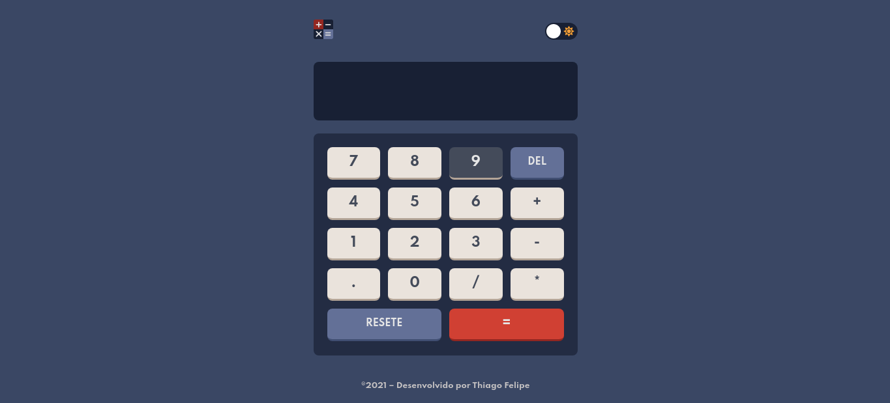
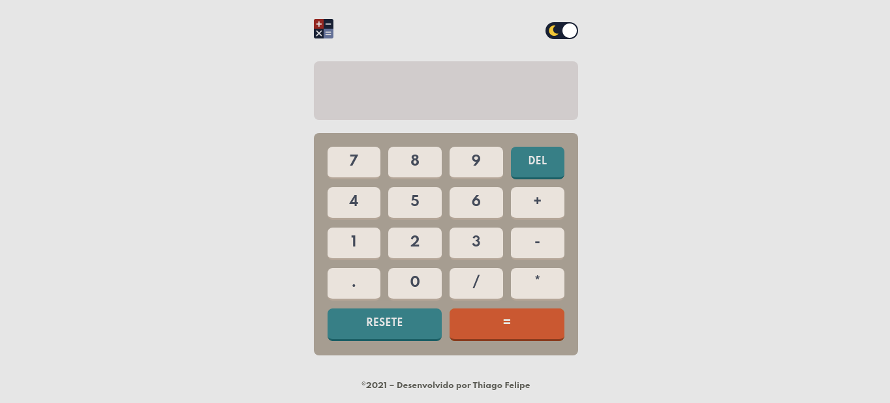

<h1>Calculadora 🖩</h1>

Projeto desenvolvido em HTML5, CSS3 e JavaScript.

<h2>Guia da aplicação</h2>

1. É necessário clonar o repositório com o seguinte comando `git@github.com:tfeliperibeiro/calculadora.git`
2. Entrar no diretório do projeto `cd calculadora`
3. Utilizar o `Live Server` para iniciar a aplicação

<a href="https://tfeliperibeiro.github.io/calculadora//">Link para ver a aplicação</a>
